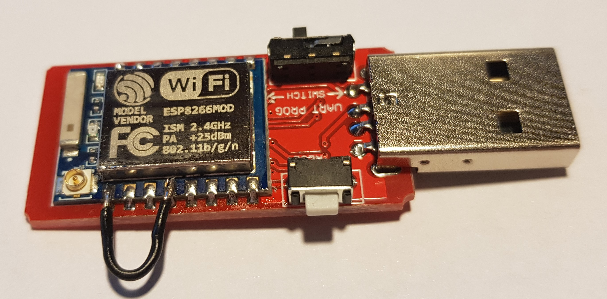
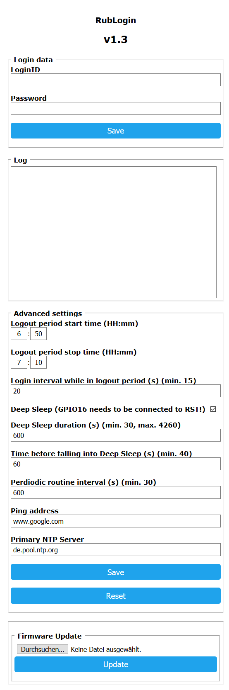

# RUB Login
An automatic login client for the RUB internet access for ESP8266 modules

## Abstract
A login client for the RUB university internet access. 
Necessary to stay connected since clients in student housings are kicked after being online for 24 hours or not using the internet for 30 minutes. 

## Deep Sleep
It is highly recommended to use the Deep Sleep function of the ESP8266 module which requiries that the **pins GPIO16 and RST are connected**.

If ESP-07 (with Open-Smart to USB converter) is used, it should look like this:

	

Please note: **Deep Sleep is enabled by default. If you don't want to use the Deep Sleep feature, you have to disable the corresponding option on the configuration page.**

## Configuration
1. Turn on the flashed ESP8266 module
2. Connect to the Wi-Fi network "RubLogin_AP"
3. Enter "192.168.4.1" into your browser's address bar
4. Select your personal Wi-Fi network, enter the key and submit. If the data is correct, you shouldn't see the "RubLogin_AP" network anymore.
5. Find out the IP address of the module (Can usually be found under the Network, Devices or DHCP section of the router's configuration page - You can also use apps like Fing)
6. Enter the IP address into your browser's address bar. Alternatively, you can use mDNS (rublogin.local) if your system supports it.
7. Enter and save your user credentials (LoginID and Password)

To access the configuration page again you should restart the ESP8266 module since it falls into Deep Sleep mode 60 seconds after starting.

## Screenshot

	

